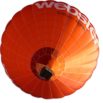

# 属性值的定义

## basic-shape

定义一个形状,作用于clip-path 与 shape-outside 属性中。

- `inset(边距 round 圆角)`
	- 边距: 1-4个参数遵循边距速记语法定义了一个与参考框指定距离的矩形
	- 圆角：使用 border-radius 速记语法定义矩形圆角
- `circle( [<shape-radius>]? [at <position>]? )` 创建一个圆形(圆的半径,圆的位置)
- `ellipse( [<shape-radius>{2}]? [at <position>]? )` 使用两个半径和一个位置定义一个椭圆。
-` polygon(fill-rule,x1 y1,x2 y2,...)` 通过一组顶点定义一个多边形,fill-rule:环绕规则(非零|奇偶)

## shape-box

指定基于什么盒模型进行裁剪。(例如选择padding-box,相当于丢弃border和margin)

- `margin-box;` 使用 margin box 作为引用框。(默认值)
- `content-box;` 使用 content box 作为引用框。
- `border-box` 用 border box 作为引用框。
- `padding-box` 使用 padding box 作为引用框。

# shape-outside

专门用于浮动元素,shape-outside 定义了一个可以是非矩形的形状,相邻的内联内容应围绕该形状进行包装。该形状不会超出原形状的范围。(类似剪切)。 属性指定为下面列出的值的一个或多个值的组合

- `<basic-shape>`
- `<shape-box>`
- `none`  不创建剪切路径。

```html

<style >
	img {
		float: left;
		shape-outside: margin-box circle(50%);
		margin: 50px;
	}
</style >
<div class = "box" >
	
	<p >
		One November night in the year 1782, so the story runs, two brothers sat over their winter fire in the little French town of
		Annonay, watching the grey smoke-wreaths from the hearth curlup the wide chimney. Their names were Stephen and Joseph
		Montgolfier, they were papermakers by trade,and were noted as possessing thoughtful minds and a deep interest in all
		scientific knowledge and new discovery. Before that night—a memorable night, as it was to prove—hundreds of millions of people
		had watched the rising smoke-wreaths of their fires without drawing any special inspiration from the fact.
	</p >
</div >
```

# clip-path

clip-path CSS 属性使用裁剪方式创建元素的可显示区域。区域内的部分显示,区域外的隐藏。clip-path 属性指定为下面列出的值的一个或多个值的组合。

- `<basic-shape>`
- `<shape-box>`
- `none`  不创建剪切路径。

```html

<style >
	div {
		clip-path: margin-box circle(50%);
		background: #aaaaaa;
	}
</style >
<div class = "box" >
	
	<p >
		One November night in the year 1782, so the story runs, two brothers sat over their winter fire in the little French town of
		Annonay, watching the grey smoke-wreaths from the hearth curlup the wide chimney. Their names were Stephen and Joseph
		Montgolfier, they were papermakers by trade,and were noted as possessing thoughtful minds and a deep interest in all
		scientific knowledge and new discovery. Before that night—a memorable night, as it was to prove—hundreds of millions of people
		had watched the rising smoke-wreaths of their fires without drawing any special inspiration from the fact.
	</p >
</div >

```
